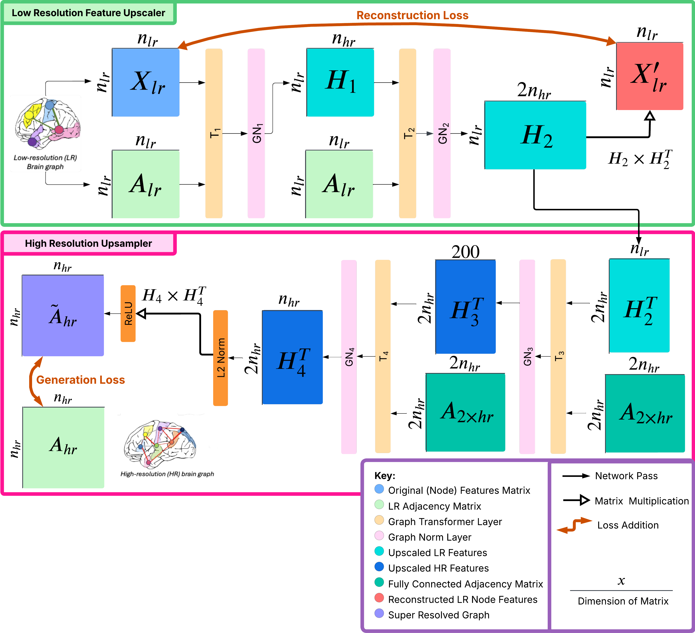
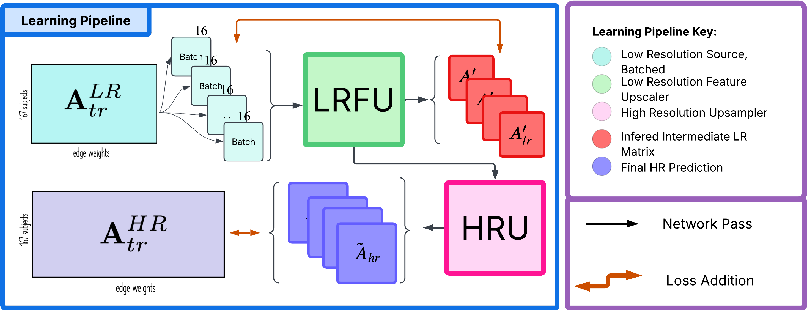

# Brain Graph Super Resolution Task
The aim of the task was to predict a high-resolution (HR) brain graph from a low-resolution (LR) brain graph using a generative Graph Neural Network trained in an inductive setting.
The dataset has low-resolution (LR) and high-resolution (HR) encodings of brain connectivity, represented in symmetric weighted connectivity matrices A_LR (dimensions 160x160) and A_HR (dimensions 268x268), respectively. Each element i,j quantifies the strength of connectivity (neural correlation) between two brain regions i and j. The aim was to train a model that generates the high-resolution (HR) connectivity matrix A_HR, given the LR connectivity matrix A_LR of the same brain.

Due to privacy restrictions, the training data cannot be published, but we have still published the model to show an alternative approach to generating high-resolution brain graphs. 

## Our implementation 
Our model, called Graph Feature Domain Expansion (GraphFDE), consists of four graph transformer blocks, each followed by normalisation layers, that progressively upsample the features so that we can finally multiply the output by its transpose to produce a symmetric, high-resolution adjacency matrix. We heavily use graph transformer blocks, as inspired by STP-GSR, to leverage a context-dependent weighting of neighbouring features in a graph. 

In the initial Low Resolution Feature Upscaler (LRFU) Block, we take the initial low resolution adjacency matrix, A_lr, and node feature matrix, X_lr, which is a copy of A_lr. Experimentation showed that these features were the most informative, compared to all-ones or other topological measures. We apply a graph transformer and graph norm layer to produce a node feature matrix, H1, that is upscaled to hrn (the HR resolution dimension) dimensional features. This process is repeated to upscale to 2hrn dimensions in H2. This is a lrn × 2hrn matrix that will be used in the loss functions.

The second is the High Resolution Upsampler (HRU). Here we take HT2, representing node features of 2hrn nodes, and a fully connected adjacency matrix (of dimension 2hrn × 2hrn and pass them through another graph transformer and graph norm block. We assume a fully connected graph so that each node’s features can attend to every other node’s features. We first scale to 200 node features and repeat this process to scale to hrn features. These are HT3 and HT4, respectively. In our post-processing, we apply the L2norm to HT4 so that we can use the similarity scores, H4 × HT4 as our high-resolution adjacency matrix. A ReLU is applied to ensure that the output is positive.

## Training pipeline 
To ensure the features learnt in the LRFU capture essential topological information about the low resolution brain graph, we use a reconstruction loss. The produced H2 is of shape (lrn × 2hrn). We define X′_lr = H2 × H2T and augment the original loss, MSE between the predicted and ground truth high resolution adjacency matrix, with the additional low resolution reconstruction loss MSE (X′_lr , X_lr ).
This ensures H2 is a good intermediate representation to upsample into the final high resolution graph. This loss is utilised in addition to the loss measured by the difference between the generated high resolution brain graph and the ground truth. 

## Running code 
We have two folders that store the baselines, baselineMLP which stores a model containing an MLP that produces a high resolution brain matrix, and baseline STP-GSR that produces high resolution brain matrices based on the following paper: https://arxiv.org/html/2411.02525v1. Our implementation is stored in the graph FDE folder. 

To run any of these models, we can run the analysis.ipynb file that trains both the models and evalates / plots their results. However note, since we have not been able to provide the data for training the task, the low resolution training matrices should be stored in lr_train.csv file, the high resolution training matrices should be stored in the hr_train.csv file, and the low resolution test matrices should be stored in the lr_test.csv file in the main directory. These csv files should store a vector of the upper triangular of the symmetric matrix representing either the low resolution or high resolution brain matrix. The dimensions would be:
- For low resolution graphs: (N * N-1) / 2 = (160 * 159)/2 = 12720
- For high resolution graphs: (N * N-1) / 2 = (268 * 267)/2 = 35778

## Results
Since our model does not convert the embeddings into a dual graph, and then back to a primal graph, it is significantly faster at inference time than STP-GSR baseline, while achieving comparable results. Given the potential academic need for large scale inference, this could dramatically decrease research time.

The model performs best relative to the baseline in terms of betweenness centrality, and the consistency of average clustering.
Both measure how good the model is at predicting the modularity of the target graph. This performance is potentially explained by the higher resolution embeddings as it provides the model with the capacity to learn more information than just edge weights.

However during training our losses became quite low, while the validation accuracy significantly slowed down in improvement quite early on
within the training epochs, suggesting overfitting, that couldn’t necessarily be fixed by early stopping, since stopping early would just lead to worse model performance overall. Thus, there was no significant improvement in our MAE for GraphFDE against the STP-GSR and MLP baselines. This suggested our parameter space was too sparse, or we were failing to emphasise the important information in our embeddings. This could be because the topology of the low resolution graph is taken into account in GraphFDE in a very limited manner. Due to the transpose operation after the first block, each node feature dimension of the initial node embedding then corresponds to a new node. However, there is little structure to ground this paradigm shift. We rely on the GraphFDE learning this.

## Report 
Report: https://www.overleaf.com/read/rrdywvzkbcyt#71b871
