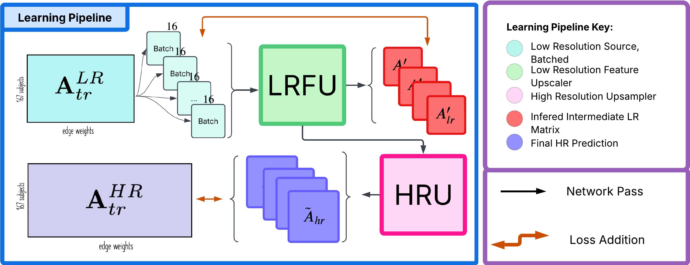

# Brain Graph Super Resolution Task
The aim of the task was to predict a high-resolution (HR) brain graph from a low-resolution (LR) brain graph using a generative Graph Neural Network trained in an inductive setting.
The dataset has low-resolution (LR) and high-resolution (HR) encodings of brain connectivity, represented in symmetric weighted connectivity matrices A_LR (dimensions 160x160) and A_HR (dimensions 268x268), respectively. Each element i,j quantifies the strength of connectivity (neural correlation) between two brain regions i and j. The aim was to train a model that generates the high-resolution (HR) connectivity matrix A_HR, given the LR connectivity matrix A_LR of the same brain.

Due to privacy restrictions, the training data cannot be published, but we have still published the model to show an alternative approach to generating high-resolution brain graphs. 

## Our implementation 
Our model, called Graph Feature Domain Expansion (GraphFDE), consists of four graph transformer blocks, each followed by normalisation layers, that progressively upsample the features so that we can finally multiply the output by its
transpose to produce a symmetric, high-resolution adjacency matrix. We heavily use graph transformer blocks, as inspired by STP-GSR, to leverage context-dependent weighting of neighbouring features in a graph. In the initial Low Resolution Feature Upscaler (LRFU) Block,
we take the initial low resolution adjacency matrix, A_lr, and node feature matrix, X_lr, which is a copy of A_lr. Experimentation showed that these features were the most informative, compared to all-ones or other topological measures. We apply a graph transformer and graph norm layer to produce a node feature matrix, H1, that is upscaled to hrn (the HR resolution dimension) dimensional features. This process is repeated to upscale to 2hrn dimensions in H2. This is a lrn × 2hrn matrix that will be used in the loss functions.

The second is the High Resolution Upsampler (HRU). Here we take HT2, representing node features of 2hrn nodes, and a fully connected adjacency matrix (of dimension 2hrn × 2hrn and pass them through another graph transformer and graph norm block. We assume a fully connected graph so that each node’s features can attend to every other node’s features. We first scale to 200 node features and repeat this process to scale to hrn features. These are HT3 and HT4, respectively. In our post-processing, we apply the L2norm to HT4 so that we can use the similarity scores, H4 × HT4 as our high-resolution adjacency matrix. A ReLU is applied to ensure that the output is positive.

## Training pipeline 

## Report 
Report: https://www.overleaf.com/read/rrdywvzkbcyt#71b871
